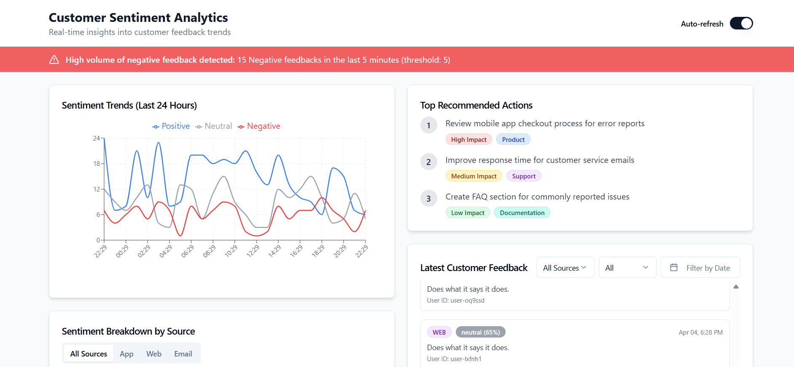
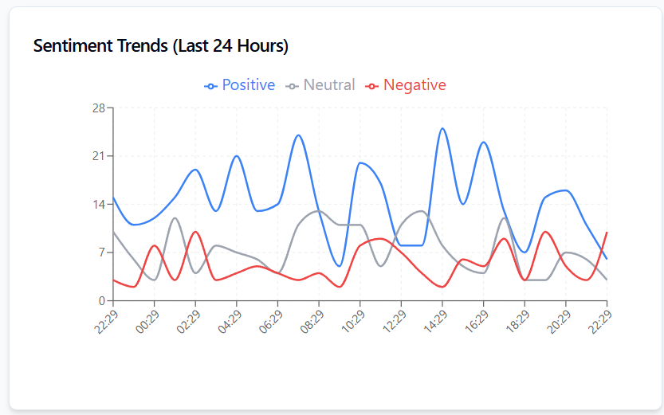
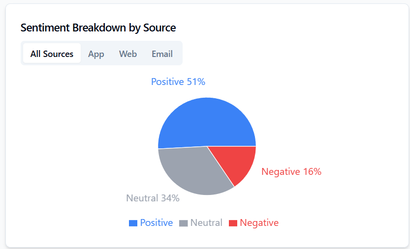
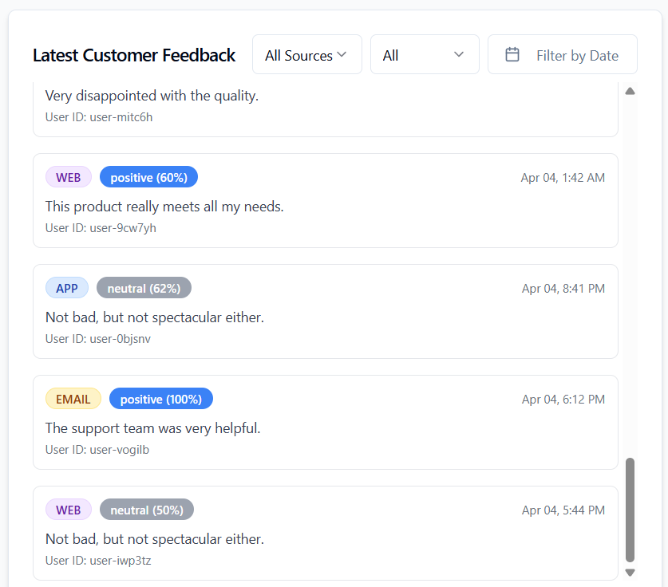
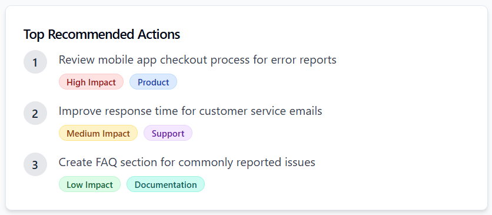

# Sentiment Analysis Dashboard


The front-end of this application is also hosted here: https://sentiment-pulse-dashboard.lovable.app/

Note: The backend and the frontend are not connecetd in this appplication yet. The conetnt in the frontend is dummy for now.

## Follow these steps for Frontend Setup:

```sh
git clone https://github.com/sanjana-mishra/sentiment-pulse-dashboard.git
cd sentiment-pulse-dashboard

# Install the necessary dependencies.
npm i

# View on Localhost
npm run dev
```

## Follow these steps for Backend Setup:

```sh
cd sentiment-pulse-dashboard
cd Backend
conda create -n dashboard python=3.9 -y
conda activate dashboard
pip install -r requirements.txt
```

All functions are defined in the functions.ipynb notebook. They are connected to DynamoDB and can be run via the cells in the notebook. 
feedback_samples.json contains all the samples created; kindly add a valis OpenAI API key in the appropriate cells.


## Technologies are used for this project 
### Frontend
- Vite
- TypeScript
- React
- shadcn-ui
- Tailwind CSS

### Backend & AI
- OpenAI APIs
- AWS stack


## Results
### Dashboard


### Time Series Chart


### Pie Chart with Sources


### Feedback logged with Filters


### Recommendations


### Alert


